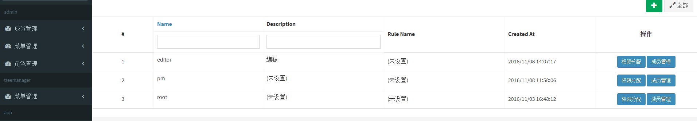
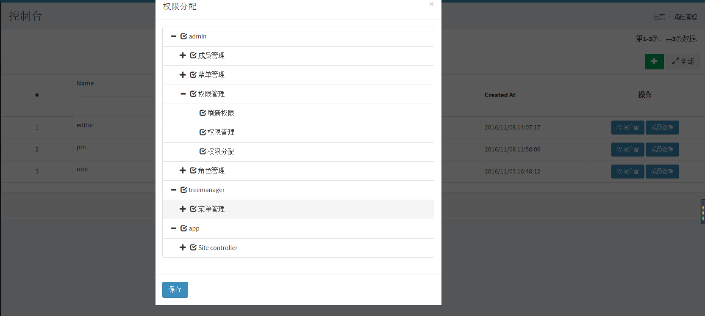

###Yii 2 admin
===============================

A lightweight admin system base on yii2, a simple yet easy to implement Role Based Access Control (rbac)Library

###DIRECTORY STRUCTURE
-------------------

```
backend
    ....
    components           base components
    controllers/         contains Web controller classes
    models/              contains backend-specific model classes
    modules/
        admin/           admin module
            controller/
            ....
    runtime/             contains files generated during runtime
    views/               contains view files for the Web application
    web/                 contains the entry script and Web resources
    ....
```

###REQUIREMENTS
===============================
A version of php is 5.4 or later.
MySQL database.


###INSTALL
===============================
The way to install this extension is through composer.
```
php composer.phar install
```
then import [db.sql](doc/db.sql) to mysql, you can modify the database connection config
System account and password:
```
admin
123456
```
###SCREENSHOT
===============================






